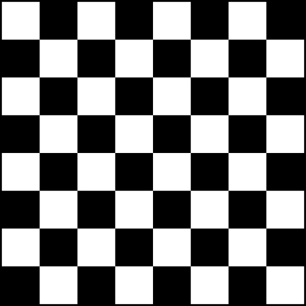
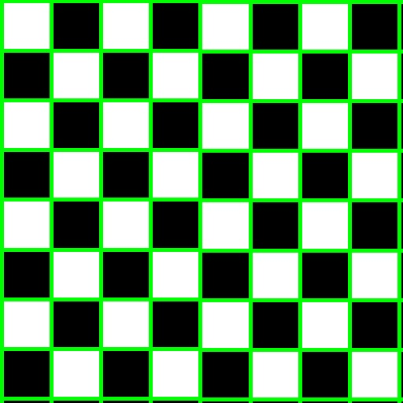
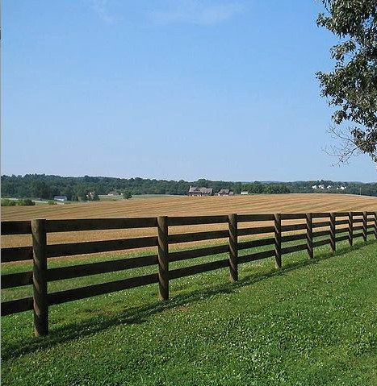
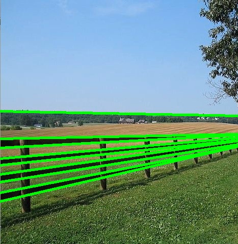
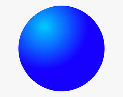
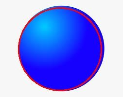
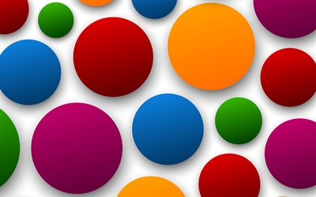
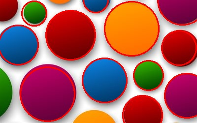

# Image Features Extraction

# Hough Lines 
 
|                       **Original**                        |              **Result**               |
| :---------------------------------------------------------------: | :------------------------------------------------------: |
|  |  |
|  |  |

HoughTransform() Function creats an empty accumulator with theta precession of 1.0 degree
Then it loops over every point in the edge image and computes ρ for every θ and increments the accumulator.

# circle_detection
- |
- 
- 

### Team members

| Name                | Sec | BN  |
| ------------------- | --- | --- |
| ezzeldeen Esmail    | 1   | 50  |
| Noran ElShahat      | 2   | 40  |
| Moamen Gamal        | 2   | 11  |
| omar sayed          | 2   | 2   |
| Abdelrahman Almahdy | 1   | 45  |
